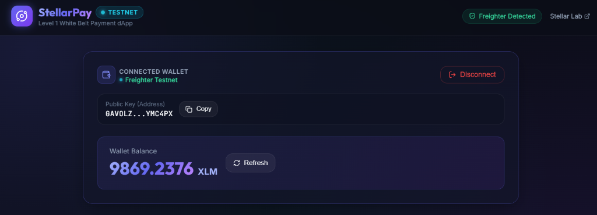
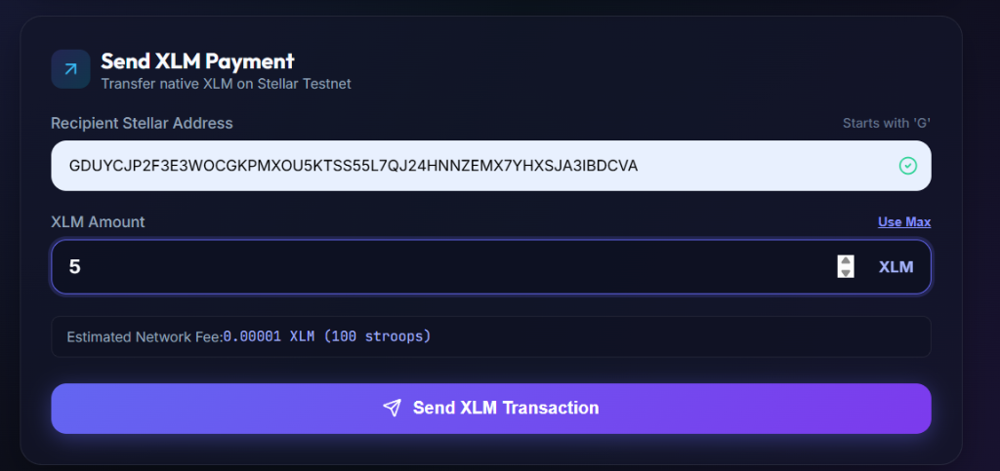
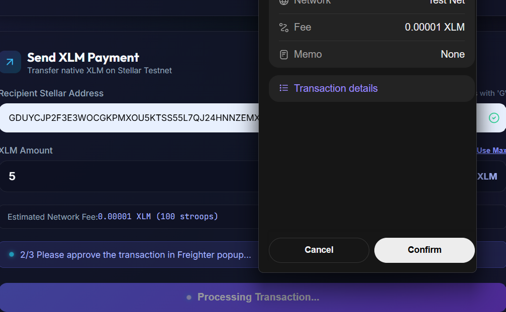
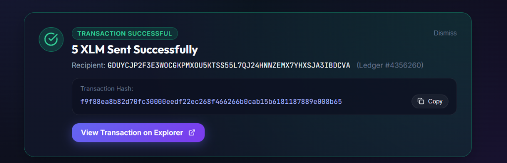

# Simple Payment dApp

A clean, modern, beginner-friendly Stellar payment application built on Stellar Testnet using React, Vite, `@stellar/stellar-sdk`, and Freighter Wallet.

🚀 **Live Deployment**: [https://simple-payment-dapp-woad.vercel.app](https://simple-payment-dapp-woad.vercel.app/)

---

## 📌 Project Description

This dApp is a simple Stellar payment application designed to demonstrate core payment functionality on the Stellar blockchain.

Users can connect their Freighter Wallet, view their active public key and live XLM balance from the Stellar Testnet Horizon server, construct and sign native XLM payment transactions through Freighter, and submit transactions directly to the Stellar Testnet network.

The application focuses on native XLM payments and does not include smart contracts, Soroban, DeFi, NFTs, fiat conversions, anchors, or other advanced blockchain functionality.

---

## ✨ Key Features

- 🔌 **Freighter Wallet Connection**: Connect and disconnect the Freighter wallet securely without handling private keys.
- 💳 **Connected Wallet Details**: Displays the connected Stellar public key with truncation and one-click copy functionality.
- 💰 **Live XLM Balance**: Retrieves the wallet's native XLM balance from the Stellar Testnet Horizon server.
- 🚰 **Testnet Friendbot Faucet**: Provides a convenient way to fund new Stellar Testnet accounts.
- 💸 **Send XLM Payment**: Allows users to send native XLM to another Stellar address.
- ✅ **Input Validation**: Validates the recipient address, payment amount, and available wallet balance.
- ✍️ **Wallet Signing**: Transactions are constructed using the Stellar SDK and signed securely through Freighter.
- 🎉 **Transaction Status**: Displays successful and failed transaction states with relevant transaction information.
- 🔍 **Transaction Explorer**: Provides a direct link to view confirmed transactions on the Stellar Testnet explorer.
- 📜 **Session History**: Keeps a record of payments completed during the current session.
- 🔄 **Automatic Balance Refresh**: Updates the wallet balance after a successful transaction.

---

## 🛠️ Technology Stack

- **Frontend Framework**: React 19 + Vite
- **Stellar SDK**: `@stellar/stellar-sdk` v13+
- **Wallet Integration**: `@stellar/freighter-api` v2+
- **Blockchain Network**: Stellar Testnet
- **Horizon Server**: `https://horizon-testnet.stellar.org`
- **Styling**: Vanilla CSS with a custom dark interface and responsive layout
- **Icons**: Lucide React

---

## 📋 Prerequisites

Before running the application locally, make sure you have:

- Node.js v18.0 or higher
- Freighter Wallet Extension installed in Chrome, Brave, or Firefox
- Freighter Network set to **Testnet**

---

## 🚀 Installation & Local Setup

### 1. Clone the Repository
```bash
git clone https://github.com/nikitabiradar231/SimplePayment.git
cd SimplePayment
```

### 2. Install Dependencies
```bash
npm install
```

### 3. Configure Environment Variables
If environment variables are required, copy the example file:
```bash
cp .env.example .env
```
Configure the required values in the `.env` file.

---

## 💻 Running the Application

Start the development server:
```bash
npm run dev
```

The application will be available at:
`http://localhost:5173`

To create a production build:
```bash
npm run build
```

---

## 🧪 Step-by-Step Testing Guide

Follow these steps to test the complete payment flow.

### 1. Connect Freighter Wallet
- Open the application.
- Make sure the Freighter extension is installed and unlocked.
- Set Freighter to the Stellar Testnet network.
- Click **Connect Freighter Wallet**.
- Approve the connection request in the Freighter popup.
- Verify that your Stellar public address beginning with `G` is displayed.

### 2. Check XLM Balance
- After connecting, check the displayed XLM balance.
- If the account is new or has no Testnet funds, click **Get Test XLM**.
- Friendbot will fund the Testnet account.
- Click **Refresh** to retrieve the updated balance.

### 3. Enter Recipient and Amount
- In the Send XLM Payment form:
  - Enter a valid Stellar recipient address (must start with `G` and contain 56 characters).
  - Enter the amount of XLM to send, for example `5`.
  - Confirm that the application accepts the amount and that sufficient balance is available.

### 4. Approve the Transaction
- Click **Send XLM Transaction**.
- The application will begin processing the transaction.
- Freighter will open and display the transaction details.
- Review the recipient, amount, and network.
- Click **Approve** in Freighter to sign the transaction.

### 5. Verify the Transaction
- After the transaction is submitted successfully:
  - A **Transaction Successful** message will appear.
  - Review the amount sent.
  - Review the recipient address.
  - Copy or view the transaction hash.
  - Open the transaction using the provided explorer link.
  - Verify the transaction on the Stellar Testnet.
  - Confirm that the wallet balance has been updated.

### 6. Test Disconnect
- Click **Disconnect** in the wallet section.
- Confirm that the connected wallet information is cleared.
- The application should return to the initial wallet connection screen.

---

## 📸 Screenshots

The following screenshots demonstrate the main application states:

### 1. Connected Wallet & Live Balance
Shows the application after successfully connecting the Freighter wallet and retrieving the current XLM balance.



### 2. Send XLM Payment Form
Shows the payment form where the recipient address and XLM amount are entered.



### 3. Freighter Wallet Approval Prompt
Shows the Freighter wallet transaction approval screen before the payment is submitted.



### 4. Transaction Successful Confirmation
Shows the successful payment confirmation, transaction hash, and transaction details.



---

## 🛡️ Security Best Practices

- **No Private Key Storage**: The application never requests, reads, stores, or transmits private keys.
- **Wallet-Based Signing**: Transaction signing is handled exclusively by Freighter.
- **Testnet Environment**: The application operates on the Stellar Testnet.
- **Client-Side Validation**: Recipient addresses, payment amounts, and available balances are validated before transactions are submitted.
- **Secure Wallet Connection**: The application only uses the public wallet information required for displaying the account and creating transactions.

---

## 🌐 Network Configuration

The application uses the Stellar Testnet environment.

- **Horizon Server**: `https://horizon-testnet.stellar.org`
- **Network Passphrase**: `Test SDF Network ; September 2015`
- **Asset**: `XLM`

---

## 📁 Project Structure

```
SimplePayment/
├── public/
├── src/
│   ├── components/
│   ├── assets/
│   ├── App.jsx
│   ├── main.jsx
│   └── ...
├── docs/
│   └── screenshots/
│       ├── 01-wallet-connected.png
│       ├── 02-send-form.png
│       ├── 03-freighter-approval.png
│       └── 04-transaction-success.png
├── .env.example
├── package.json
├── vite.config.js
└── README.md
```

---

## 📄 License

This project is licensed under the MIT License.
