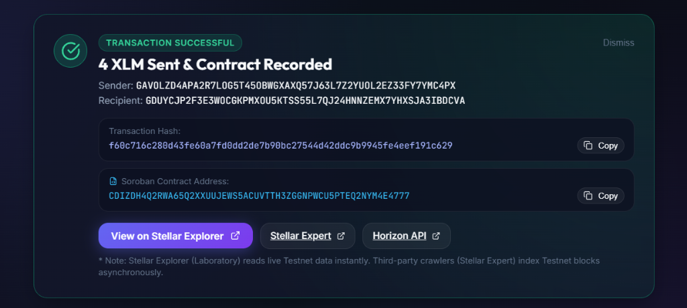

# Stellar Level 1 White Belt: Simple Payment dApp

A clean, modern, beginner-friendly **Stellar Level 1 Payment Application** built on **Stellar Testnet** using **React**, **Vite**, **@stellar/stellar-sdk**, and **Freighter Wallet**.

---

## 📌 Project Description

This dApp is a **Stellar Level 1 White Belt** implementation designed to demonstrate core payment flows on the Stellar blockchain. Users can connect their **Freighter Wallet**, view their active public key and live XLM balance from Stellar Testnet Horizon RPC, construct and sign native XLM payment transactions via Freighter, and submit them directly to the Stellar Testnet network.

> [!NOTE]
> This project strictly fulfills Level 1 White Belt requirements. It does **not** include smart contracts (Soroban), cross-border payment hubs, fiat conversions, anchors, DeFi, or NFTs.

---

## ✨ Key Features

- 🔌 **Freighter Wallet Connection**: Detects, connects, and disconnects the Freighter extension securely without handling private keys.
- 💳 **Connected Wallet Details**: Displays the user's connected public key with truncation and one-click copy.
- 💰 **Live XLM Balance**: Queries native XLM balance in real time from `https://horizon-testnet.stellar.org`.
- 🚰 **Testnet Friendbot Faucet**: Provides a one-click funding button for new unfunded Testnet accounts.
- 💸 **Send XLM Payment**: Form to send native XLM payments with input validation (recipient address check, positive amount check, balance validation).
- ✍️ **Wallet Signing**: Transactions are constructed using `@stellar/stellar-sdk` and signed securely via Freighter.
- 🎉 **Success & Failure States**: Displays complete transaction feedback, transaction hash, and auto-refreshes the wallet balance.
- 🔍 **Stellar Expert Explorer Link**: Direct link to inspect confirmed transactions on the Stellar Expert Testnet explorer.
- 📜 **Session History**: Maintains a history log of payments completed during the session.

---

## 🛠️ Technology Stack

- **Frontend Framework**: [React 19](https://react.dev/) + [Vite](https://vitejs.dev/)
- **Stellar SDK**: [`@stellar/stellar-sdk`](https://www.npmjs.com/package/@stellar/stellar-sdk) (v13+)
- **Wallet Integration**: [`@stellar/freighter-api`](https://www.npmjs.com/package/@stellar/freighter-api) (v2+)
- **Styling**: Vanilla CSS (Custom Cosmic Dark Design Tokens, Glassmorphism, Responsive Grid)
- **Icons**: [Lucide React](https://lucide.dev/)

---

## 📋 Prerequisites

Before running this application locally, ensure you have:

1. **Node.js**: v18.0.0 or higher ([Download Node.js](https://nodejs.org/))
2. **Freighter Wallet Extension**: Installed in Chrome/Brave/Firefox ([Install Freighter](https://www.freighter.app/))
3. **Freighter Network Mode**: Set your Freighter extension network to **Testnet** (Settings → Network → Testnet).

---

## 🚀 Installation & Local Setup

1. **Clone the Repository**:
   ```bash
   git clone https://github.com/nikitabiradar231/SimplePayment.git
   cd SimplePayment
   ```

2. **Install Dependencies**:
   ```bash
   npm install
   ```

3. **Configure Environment Variables** (Optional):
   Copy `.env.example` to `.env`:
   ```bash
   cp .env.example .env
   ```

---

## 💻 Running the Application

To start the local development server:

```bash
npm run dev
```

The application will be accessible at `http://localhost:5173`.

To build the production distribution bundle:
```bash
npm run build
```

---

## 🧪 Step-by-Step Testing Guide

Follow these steps to verify the full Level 1 payment flow:

### 1. Connect Freighter Wallet
- Open `http://localhost:5173`.
- Ensure Freighter extension is installed and unlocked.
- Click **"Connect Freighter Wallet"**.
- Approve the access prompt inside Freighter popup.
- Verify your public Stellar address (`G...`) is displayed.

### 2. Check XLM Balance
- Verify that your live XLM balance from Stellar Testnet appears on screen.
- If your Testnet account is new or unfunded (0 XLM balance), click **"Get Test XLM"** to fund your wallet with 10,000 XLM via Stellar Friendbot.
- Click **"Refresh"** to confirm balance updating from Horizon.

### 3. Enter Recipient & Amount
- In the **Send XLM Payment** form:
  - Enter a valid recipient Stellar Testnet address (must start with `G` and be 56 characters).
  - Enter an XLM amount (e.g. `5`).
  - Notice real-time client validation ensuring address format and sufficient balance.

### 4. Approve Transaction in Freighter
- Click **"Send XLM Transaction"**.
- The button state will change to **"Processing Transaction..."**.
- Freighter popup will appear displaying transaction details (Recipient address, amount, network: TESTNET).
- Click **"Approve"** in Freighter.

### 5. Verify Success & Transaction Hash
- Upon submission to Horizon, a green **Transaction Successful** card appears.
- Review the **Amount Sent**, **Recipient**, and full **Transaction Hash**.
- Click **"View Transaction on Explorer"** to verify on [Stellar Expert Testnet Explorer](https://stellar.expert/explorer/testnet).
- Confirm your **Wallet Balance** has automatically updated.

### 6. Test Disconnect
- Click **"Disconnect"** in the wallet card header.
- Confirm all connected wallet state and balance cleared, returning you to the initial connection screen.

---

## 📸 Screenshots

> [!NOTE]
> Screenshots illustrating the application states on Stellar Testnet:

### 1. Wallet Connected State


### 2. XLM Balance Displayed


### 3. Successful Testnet Transaction


### 4. Transaction Result Shown to the User


---

## 🛡️ Security Best Practices

- **Zero Private Key Storage**: The application never requests, reads, stores, or transmits private/secret keys.
- **Client-Side Wallet Delegation**: All transaction signing is delegated exclusively to Freighter.
- **Strict Testnet Scope**: All requests target `https://horizon-testnet.stellar.org` and use passphrase `Test SDF Network ; September 2015`.

---

## 📜 License

MIT License. Built for the Stellar Level 1 White Belt Certification.
