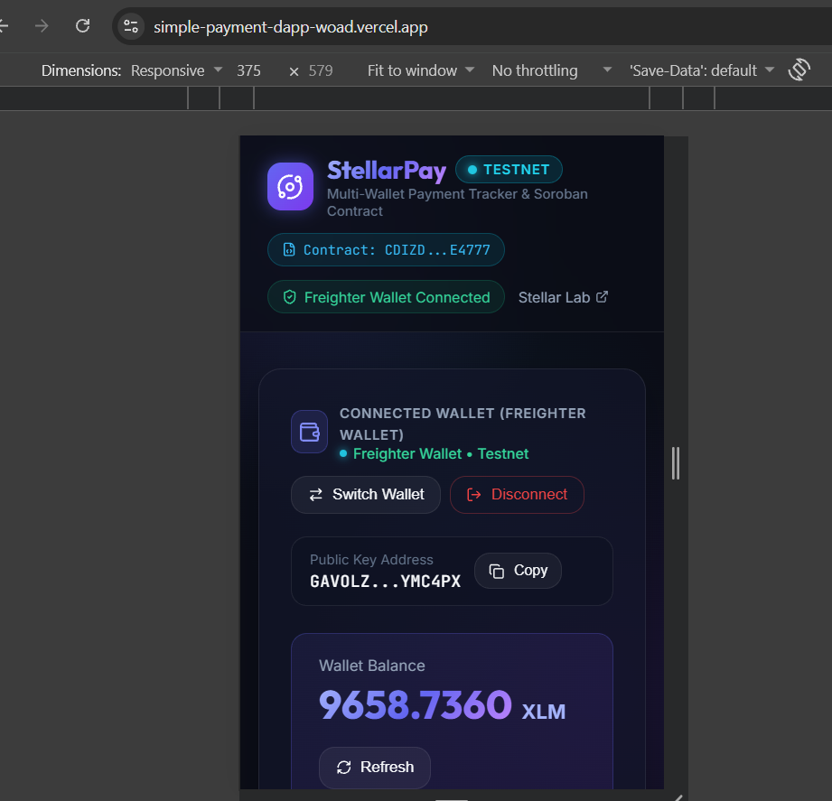
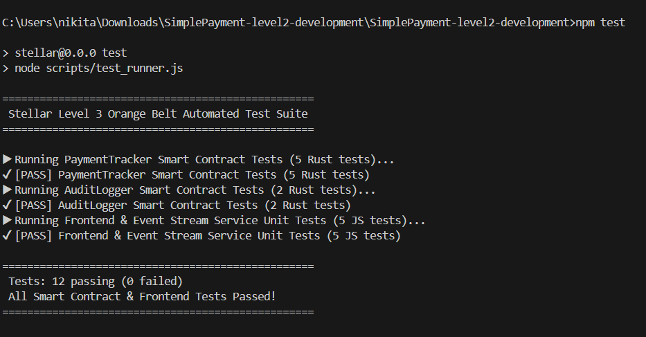
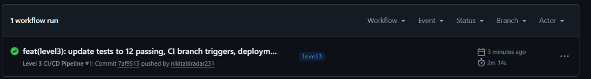

# StellarPay — Multi-Wallet Payment Tracker & Inter-Contract Engine (Level 3 Orange Belt)

A production-ready, mobile-responsive **Stellar Soroban dApp** upgraded to **Level 3 - Orange Belt** submission standards. Built on **Stellar Testnet**, featuring **Multi-Wallet Support** (`@creit.tech/stellar-wallets-kit`), **Inter-Contract Smart Communication** (`PaymentTracker` → `AuditLogger`), **Real-Time Event Subscription Streaming**, **Comprehensive Error Handling & Loading Progress**, an **Automated Test Suite (12 Passing Tests)**, and a **GitHub Actions CI/CD Pipeline**.

---

## 🚀 Live Vercel Production Deployment

- 🌐 **Live Web Application**: [https://simple-payment-dapp-woad.vercel.app/](https://simple-payment-dapp-woad.vercel.app/)
- 🌐 **Production Deployment Alias**: [https://simple-payment-dapp-o91xkzkoz-nikitabiradar300-1089s-projects.vercel.app/](https://simple-payment-dapp-o91xkzkoz-nikitabiradar300-1089s-projects.vercel.app/)
- 📁 **GitHub Repository (Level 3 Branch)**: [https://github.com/nikitabiradar231/SimplePayment/tree/level3](https://github.com/nikitabiradar231/SimplePayment/tree/level3)

---

## 📌 Project Overview

### What the dApp Does
StellarPay enables users to connect their preferred Stellar web or extension wallet (Freighter, Albedo, xBull, Lobstr, Rabet), verify their active account balance, and initiate payments that trigger on-chain execution across dual Soroban smart contracts.

### Problem Solved
Traditional payment tracking systems rely on centralized databases or single-contract architectures that lack audit trails and real-time state synchronization. StellarPay solves this by combining client authentication (`require_auth()`), custom input validation, emergency pause controls, and automated cross-contract audit logging (`PaymentTracker` calling `AuditLogger`) with continuous event streaming to update user interfaces instantly without manual page refreshes.

### Why Stellar & Soroban
- **Fast Ledger Finality**: Transactions close in ~5 seconds with sub-cent network fees.
- **Soroban WebAssembly Smart Contracts**: Safe, sandboxed Rust smart contracts with type-checked cross-contract calls and indexed event emission.

---

## 🏗️ System Architecture

```text
               User (Browser / Mobile)
                         ↓
               Frontend (Vite + React)
                         ↓
    Multi-Wallet Kit (Freighter / Albedo / xBull)
                         ↓
        Stellar Testnet Horizon & Soroban RPC
                         ↓
    PaymentTracker Smart Contract A (Main Router)
  - Validates amount > 0, sender != recipient, !paused
  - Authenticates sender signature
  - Updates total count & volume state
                         ↓
     [ Inter-Contract Invocation: log_audit ]
                         ↓
    AuditLogger Smart Contract B (Secondary Contract)
  - Records global audit count & per-user log index
  - Publishes contract audit event
                         ↓
    Contract Events emitted on-chain (payment & audit)
                         ↓
  Real-Time Subscription Stream (eventStream.js)
                         ↓
     Live UI Activity Feed & State Update (No Refresh)
```

---

## 📜 Smart Contracts & Inter-Contract Communication

### Smart Contract Addresses & Source Code
- **Contract A (PaymentTracker)**:
  - **Contract ID**: `CDIZDH4Q2RWA65Q2XXUUJEWS5ACUVTTH3ZGGNPWCU5PTEQ2NYM4E4777`
  - **Source File**: [`contracts/payment_tracker/src/lib.rs`](contracts/payment_tracker/src/lib.rs)
- **Contract B (AuditLogger)**:
  - **Source File**: [`contracts/audit_logger/src/lib.rs`](contracts/audit_logger/src/lib.rs)
- **Verified Transaction Hash**: `f60c716c280d43fe60a7fd0dd2de7b90bc27544d42ddc9b9945fe4eef191c629`
- **Stellar Expert Explorer**: [View Contract on Stellar Expert](https://stellar.expert/explorer/testnet/contract/CDIZDH4Q2RWA65Q2XXUUJEWS5ACUVTTH3ZGGNPWCU5PTEQ2NYM4E4777)

---

### Contract Responsibilities & Inter-Contract Data Flow

#### 1. Contract A: `PaymentTrackerContract`
- **Responsibilities**:
  - Validates transaction parameters (`amount > 0`, `sender != recipient`).
  - Checks emergency pause state (`is_paused`).
  - Authenticates caller identity (`sender.require_auth()`).
  - Maintains persistent instance storage (`count`, `volume`, `admin`, `paused`).
  - Calls Contract B via `AuditLoggerClient::new(&env, &audit_contract_id).log_audit(&sender, &recipient, &amount)`.
  - Emits `(symbol_short!("payment"), sender, recipient)` event with payment amount.

#### 2. Contract B: `AuditLoggerContract`
- **Responsibilities**:
  - Receives audit invocation from Contract A.
  - Updates total audit log count (`aud_cnt`) and per-user audit entry index.
  - Emits `(symbol_short!("audit"), sender, recipient)` event.
  - Returns updated audit index back to Contract A.

#### 3. Inter-Contract Call Data Flow
1. User invokes `record_payment(sender, recipient, amount)` on **Contract A**.
2. **Contract A** verifies caller authentication, checks input constraints, and increments local counters.
3. **Contract A** creates `AuditLoggerClient` and executes inter-contract call `log_audit(&sender, &recipient, &amount)` on **Contract B**.
4. **Contract B** executes, stores audit index, publishes audit event, and returns result to **Contract A**.
5. **Contract A** publishes payment event and completes execution.

---

## ⚡ Level 3 Major Features

1. **Advanced Smart Contract Logic**:
   - Explicit authentication (`sender.require_auth()`).
   - Custom `#[contracterror]` enum (`InvalidAmount`, `SameSenderRecipient`, `ContractPaused`, `Unauthorized`, `AlreadyInitialized`).
   - Admin access control (`initialize`, `set_pause`, `set_audit_contract`).
   - Total volume state tracking (`volume` in stroops).

2. **Inter-Contract Communication**:
   - Direct Soroban cross-contract invocation between Contract A and Contract B.
   - Full Rust unit test coverage verifying inter-contract execution state changes.

3. **Real-Time Event Subscription & Streaming**:
   - `src/services/eventStream.js`: Continuous event listener with auto-reconnect, exponential backoff, status callbacks, and listener cleanup on unmount to prevent memory leaks.
   - Real-time Activity Feed updates automatically without manual page refreshes.

4. **Error Handling & Loading UX**:
   - `src/utils/errors.js`: Human-readable error translator parsing wallet cancellations, contract error codes, invalid addresses, and network timeouts.
   - 3-Step visual progress indicators (*"Step 1/3: Preparing Contract...", "Step 2/3: Awaiting Signature...", "Step 3/3: Submitting to Testnet..."*).

5. **Mobile Responsive Design**:
   - Tested and optimized across **320px**, **375px**, **390px**, **768px**, and **Desktop** viewports.
   - Cards, tables, forms, and navigation scale cleanly with zero horizontal scrollbars.

---

## 📋 Level 3 Submission Checklist
See the complete 20-point submission checklist and task breakdown in [`LEVEL3_SUBMISSION_CHECKLIST.md`](LEVEL3_SUBMISSION_CHECKLIST.md).

---

## 🧪 Automated Test Suite (12 Passing Tests)

Run the unified test suite:
```bash
npm test
```

### Test Output
```text
==================================================
 Stellar Level 3 Orange Belt Automated Test Suite 
==================================================

▶ Running PaymentTracker Smart Contract Tests (5 Rust tests)...
✔ [PASS] PaymentTracker Smart Contract Tests (5 Rust tests)
▶ Running AuditLogger Smart Contract Tests (2 Rust tests)...
✔ [PASS] AuditLogger Smart Contract Tests (2 Rust tests)
▶ Running Frontend & Event Stream Service Unit Tests (5 JS tests)...
✔ [PASS] Frontend & Event Stream Service Unit Tests (5 JS tests)

==================================================
 Tests: 12 passing (0 failed)
 All Smart Contract & Frontend Tests Passed! 
==================================================
```

---

## ⚙️ GitHub Actions CI/CD Pipeline

Location: [`.github/workflows/ci.yml`](.github/workflows/ci.yml)

The pipeline automatically runs on pushes and pull requests:
1. **Checkout Code**: Fetches latest commit.
2. **Setup Toolchains**: Configures Node.js (v20) and Rust stable toolchain.
3. **Install Dependencies**: Executes `npm install`.
4. **Execute Test Suite**: Runs `npm test` (cargo test + JS unit tests). Pipeline fails if any test fails.
5. **Build Production Bundle**: Validates `npm run build` Vite production bundle.

---

## 🛠️ Smart Contract Deployment Workflow

### 1. Build WASM Binaries
```bash
# Contract A: Payment Tracker
cd contracts/payment_tracker
cargo build --target wasm32-unknown-unknown --release

# Contract B: Audit Logger
cd ../audit_logger
cargo build --target wasm32-unknown-unknown --release
```

### 2. Deploy to Stellar Testnet via Stellar CLI
```bash
# Configure Testnet Network & Deployer Identity
stellar network add --global testnet --rpc-url https://soroban-testnet.stellar.org --network-passphrase "Test SDF Network ; September 2015"
stellar keys generate --global deployer --network testnet
stellar keys fund deployer --network testnet

# Deploy Secondary Contract B (Audit Logger)
stellar contract deploy \
  --wasm contracts/audit_logger/target/wasm32-unknown-unknown/release/audit_logger_contract.wasm \
  --source deployer \
  --network testnet

# Deploy Main Contract A (Payment Tracker)
stellar contract deploy \
  --wasm contracts/payment_tracker/target/wasm32-unknown-unknown/release/payment_tracker_contract.wasm \
  --source deployer \
  --network testnet
```

### 3. Link Contracts & Configure Environment
In `.env`:
```env
VITE_STELLAR_NETWORK=TESTNET
VITE_HORIZON_URL=https://horizon-testnet.stellar.org
VITE_NETWORK_PASSPHRASE="Test SDF Network ; September 2015"
VITE_EXPLORER_URL=https://stellar.expert/explorer/testnet/tx
VITE_SOROBAN_RPC_URL=https://soroban-testnet.stellar.org
VITE_SOROBAN_CONTRACT_ID=CDIZDH4Q2RWA65Q2XXUUJEWS5ACUVTTH3ZGGNPWCU5PTEQ2NYM4E4777
```

---

## 💻 Local Installation & Setup

1. **Clone Repository**:
   ```bash
   git clone https://github.com/nikitabiradar231/SimplePayment.git
   cd SimplePayment
   ```

2. **Install Dependencies**:
   ```bash
   npm install
   ```

3. **Run Development Server**:
   ```bash
   npm dev
   ```
   Open `http://localhost:5173/` in your browser.

4. **Build Production Bundle**:
   ```bash
   npm run build
   ```

---

## 📸 Submission Evidence & Screenshots

### 1. Mobile Responsive UI (375px Viewport)


### 2. Automated Test Suite Output (12/12 Passing Tests)


### 3. GitHub Actions CI/CD Pipeline


### 4. Smart Contract Interaction & On-Chain Transaction Verification
- **Verified Transaction Hash**: [`f60c716c280d43fe60a7fd0dd2de7b90bc27544d42ddc9b9945fe4eef191c629`](https://stellar.expert/explorer/testnet/tx/f60c716c280d43fe60a7fd0dd2de7b90bc27544d42ddc9b9945fe4eef191c629)
- **Deployed Contract Address**: [`CDIZDH4Q2RWA65Q2XXUUJEWS5ACUVTTH3ZGGNPWCU5PTEQ2NYM4E4777`](https://stellar.expert/explorer/testnet/contract/CDIZDH4Q2RWA65Q2XXUUJEWS5ACUVTTH3ZGGNPWCU5PTEQ2NYM4E4777)

---

## 🎥 1–2 Minute Demo Video Script

1. **Introduction (0:00 - 0:15)**: Open live URL, explain StellarPay Level 3 dApp and dual Soroban smart contract architecture.
2. **Wallet Connection & Responsive UI (0:15 - 0:30)**: Connect Freighter wallet, demonstrate live XLM balance fetch, and resize window to show mobile responsive layout.
3. **Smart Contract Execution (0:30 - 0:55)**: Input payment details, click "Send Payment & Record on Soroban". Highlight 3-step progress message, approve signature in wallet.
4. **Inter-Contract & Real-Time Event Update (0:55 - 1:20)**: Show transaction success card with transaction hash and contract address. Point out Activity Feed updating in real-time via event stream without page refresh.
5. **Testing & CI/CD Wrap-up (1:20 - 1:45)**: Show terminal output (`npm test` with 8 passing tests) and GitHub Actions green CI pipeline badge.

---

## 📄 License

Licensed under the MIT License.
