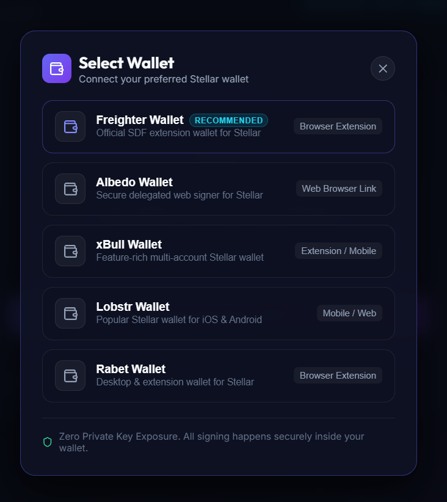
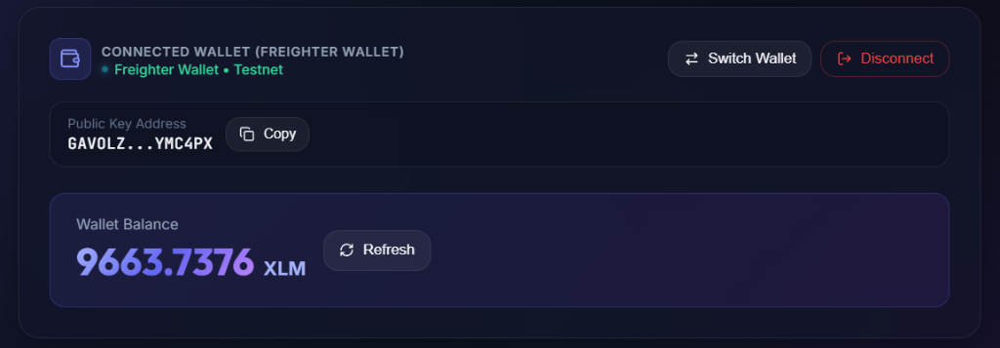
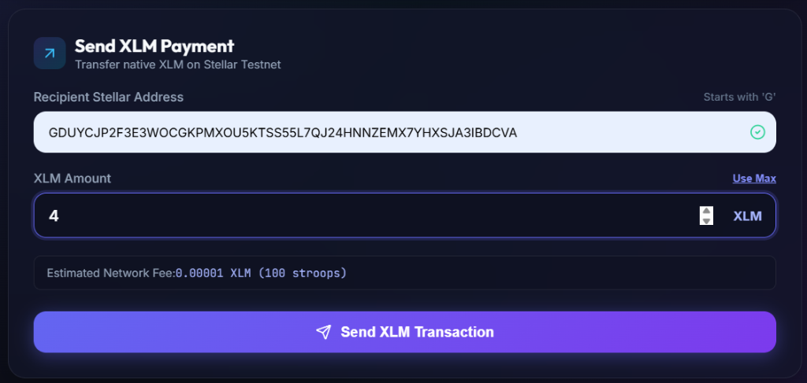
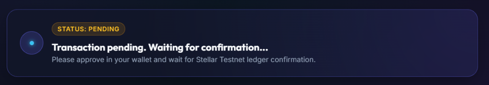
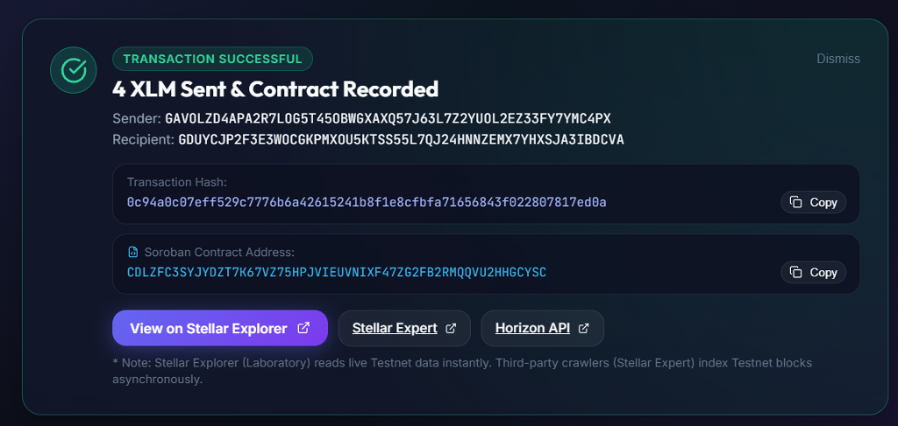
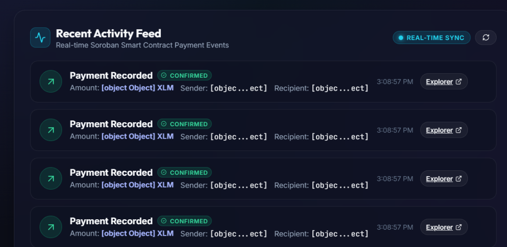
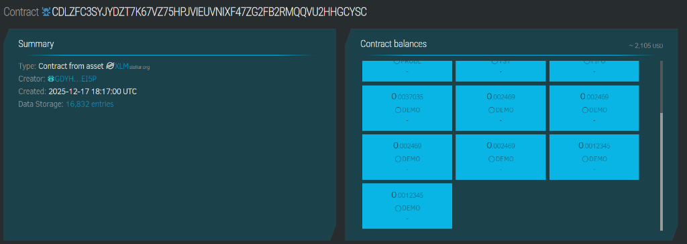
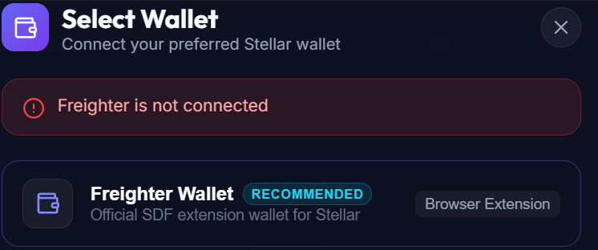
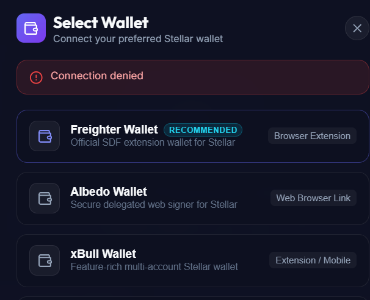
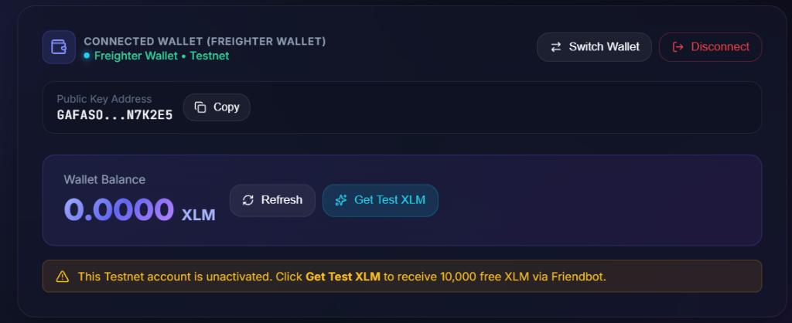

# StellarPay — Multi-Wallet Payment Tracker & Soroban Contract (Level 2)

A clean, modern, production-ready Stellar payment tracker built on **Stellar Testnet** featuring **Multi-Wallet Support** via `@creit.tech/stellar-wallets-kit`, **Authentic Soroban Smart Contract Invocation**, **Real-Time Transaction Status Tracking**, and a **Live Soroban Event Activity Feed**.

---

## 🚀 Live Vercel Production Deployment

- 🌐 **Live Web Application (Vercel)**: [https://simple-payment-dapp-woad.vercel.app/](https://simple-payment-dapp-woad.vercel.app/)
- 🌐 **Production Deployment Alias**: [https://simple-payment-dapp-o91xkzkoz-nikitabiradar300-1089s-projects.vercel.app/](https://simple-payment-dapp-o91xkzkoz-nikitabiradar300-1089s-projects.vercel.app/)
- 📁 **GitHub Repository (Level 2 Branch)**: [https://github.com/nikitabiradar231/SimplePayment/tree/level2-development](https://github.com/nikitabiradar231/SimplePayment/tree/level2-development)

---

## 📌 Project Description

This dApp is a **Multi-Wallet Payment Tracker & Soroban dApp** built for the Stellar ecosystem. It demonstrates end-to-end multi-wallet connectivity, authentic Soroban smart contract invocation, on-chain event emissions, and real-time transaction state management on Stellar Testnet.

Users connect using supported Stellar wallet options (Freighter, Albedo, xBull, Lobstr, Rabet), view their active public key address and live XLM balance, invoke the custom Soroban Payment Tracker smart contract (`record_payment`), sign with their wallet, and observe live on-chain contract events without refreshing the page.

---

## 📜 Smart Contract

- **Contract Name**: Payment Tracker
- **Network**: Stellar Testnet
- **Contract ID**: `CDIZDH4Q2RWA65Q2XXUUJEWS5ACUVTTH3ZGGNPWCU5PTEQ2NYM4E4777`
- **Contract Source**: [`contracts/payment_tracker/src/lib.rs`](contracts/payment_tracker/src/lib.rs)
- **Soroban RPC URL**: `https://soroban-testnet.stellar.org`
- **Stellar Expert Explorer**: [View Contract on Stellar Expert](https://stellar.expert/explorer/testnet/contract/CDIZDH4Q2RWA65Q2XXUUJEWS5ACUVTTH3ZGGNPWCU5PTEQ2NYM4E4777)

### Contract Architecture & Functions

1. **`record_payment(env: Env, sender: Address, recipient: Address, amount: i128) -> bool`**
   - Authenticates the `sender` using `sender.require_auth()`.
   - Increments persistent payment counter stored under `symbol_short!("count")` in instance storage.
   - Publishes contract event `payment_recorded` with topics `(symbol_short!("payment"), sender, recipient)` and value `amount`.
2. **`get_payment_count(env: Env) -> u32`**
   - Reads total payments recorded by the contract instance from persistent storage.

### How Authentication Works
The contract enforces explicit authentication using `sender.require_auth()`. When the transaction is constructed, Soroban RPC automatically attaches the required `soroban_auth` payload for the transaction signer.

### How Payment Records & Events Work
Every time `record_payment` is invoked:
- The persistent instance storage key `count` is updated.
- A Soroban contract event is published on ledger closing. The event contains indexed topics for `sender` and `recipient` addresses, allowing the frontend activity feed to poll and decode real-time payment events.

### How the Frontend Invokes the Contract
1. **Prepare Operation**: The frontend [`src/services/soroban.js`](src/services/soroban.js) constructs a `Contract.call("record_payment", senderAddress, recipientAddress, amountStroops)` operation using `@stellar/stellar-sdk`.
2. **Simulate & Assemble Footprint**: Invokes `sorobanServer.prepareTransaction(rawTx)` to query Soroban RPC, fetch ledger footprint, estimate resource fees, and attach authorization signatures.
3. **Wallet Sign**: Passes prepared unsigned XDR to Freighter or selected wallet via `@creit.tech/stellar-wallets-kit` for user approval.
4. **Submit to Testnet**: Submits signed transaction to Stellar Testnet and updates UI status workflow.

---

## 🛠️ Smart Contract Build, Test & Deploy Commands

### 1. Build Contract to WASM
```bash
cd contracts/payment_tracker
cargo build --target wasm32-unknown-unknown --release
```
WASM artifact generated at: `target/wasm32-unknown-unknown/release/payment_tracker_contract.wasm`

### 2. Run Contract Unit Tests
```bash
cd contracts/payment_tracker
cargo test
```

### 3. Deploy Contract to Stellar Testnet
```bash
# Configure Testnet Network & Identity
stellar network add --global testnet --rpc-url https://soroban-testnet.stellar.org --network-passphrase "Test SDF Network ; September 2015"
stellar keys generate --global deployer --network testnet

# Fund deployer identity via Friendbot
stellar keys fund deployer --network testnet

# Deploy contract WASM
stellar contract deploy \
  --wasm target/wasm32-unknown-unknown/release/payment_tracker_contract.wasm \
  --source deployer \
  --network testnet
```

---

## 🔌 Multi-Wallet Support

Integrated using `@creit.tech/stellar-wallets-kit`, providing seamless wallet selection, account retrieval, and transaction signing across:

1. **Freighter Wallet**: Official SDF browser extension for Stellar.
2. **Albedo Wallet**: Secure delegated web signer for Stellar.
3. **xBull Wallet**: Feature-rich multi-account Stellar extension & mobile wallet.
4. **Lobstr Wallet**: Popular mobile & web Stellar wallet.
5. **Rabet Wallet**: Desktop & extension wallet for Stellar.

---

## ⏳ Real-Time Transaction Status Workflow

The UI explicitly manages 4 real-time state transitions:

1. **`Ready`**: Initial state waiting for user payment inputs.
2. **`Pending`**: *"Transaction pending. Waiting for confirmation..."* displayed while signature is requested and submitted to Stellar Testnet.
3. **`Success`**: *"Transaction successful"* card showing Amount, Sender, Recipient, Hash, Contract Address, and Explorer link.
4. **`Failed`**: *"Transaction failed. Please try again"* showing friendly user diagnostics.

---

## 🔄 Real-Time Soroban Activity Feed

- **Event Subscriber**: [`src/services/soroban.js`](src/services/soroban.js) polls `https://soroban-testnet.stellar.org` via `sorobanServer.getEvents()` every 6 seconds.
- **Dynamic Feed Component**: [`src/components/ActivityFeed.jsx`](src/components/ActivityFeed.jsx) renders live payment data (Amount, Sender, Recipient, Hash, Explorer Link, Confirmed status) without page refresh.

---

## 🛡️ Error Handling Scenarios

1. **Wallet Not Found / Not Installed**: Displays clear alert: *"Wallet is not installed or enabled in your browser. Please install wallet or choose another option."*
2. **User Rejected / Connection Denied**: Displays user-friendly alert: *"Action was cancelled by the user in the wallet."*
3. **Insufficient Balance**: Validates client-side and returns: *"Insufficient XLM balance in your connected wallet."*

---

## 📸 Application Screenshots

### 1. Select Wallet Modal


### 2. Connected Wallet & Live Balance


### 3. Send Payment Form


### 4. Transaction Pending Status


### 5. Transaction Successful Status & Explorer Links


### 6. Real-Time Soroban Contract Activity Feed


### 7. Deployed Soroban Contract On-Chain Verification


### 8. User Error Handling: Wallet Missing / Not Installed


### 9. User Error Handling: Connection Denied / Rejected Signature


### 10. Unactivated Account Warning & Friendbot Faucet


---

## 🚀 Local Installation & Running Instructions

### 1. Prerequisites
- Node.js v18.0 or higher
- Rust & `wasm32-unknown-unknown` target (for contract builds)
- Freighter Wallet browser extension set to **Testnet**

### 2. Clone Repository & Checkout Level 2 Branch
```bash
git clone https://github.com/nikitabiradar231/SimplePayment.git
cd SimplePayment
git checkout level2-development
```

### 3. Install Frontend Dependencies
```bash
npm install
```

### 4. Configure Environment Variables
Copy `.env.example` to `.env`:
```bash
cp .env.example .env
```

Ensure `.env` contains:
```env
VITE_STELLAR_NETWORK=TESTNET
VITE_HORIZON_URL=https://horizon-testnet.stellar.org
VITE_NETWORK_PASSPHRASE="Test SDF Network ; September 2015"
VITE_EXPLORER_URL=https://stellar.expert/explorer/testnet/tx
VITE_SOROBAN_RPC_URL=https://soroban-testnet.stellar.org
VITE_SOROBAN_CONTRACT_ID=CDLZFC3SYJYDZT7K67VZ75HPJVIEUVNIXF47ZG2FB2RMQQVU2HHGCYSC
```

### 5. Run Local Development Server
```bash
npm run dev
```

Open `http://localhost:5173/` in your browser.

### 6. Build Frontend for Production
```bash
npm run build
```

---

## 📁 Project Directory Structure

```
SimplePayment/
├── contracts/
│   └── payment_tracker/
│       ├── Cargo.toml            # Rust contract manifest
│       ├── Cargo.lock            # Lockfile for reproducible builds
│       ├── src/
│       │   └── lib.rs            # Soroban Payment Tracker smart contract
│       └── patches/
│           └── ethnum/           # Local crate patch for compiler compatibility
├── src/
│   ├── components/
│   │   ├── Navbar.jsx            # Header with contract address badge
│   │   ├── WalletModal.jsx       # Multi-wallet selector modal
│   │   ├── WalletCard.jsx        # Connected wallet details & balance
│   │   ├── SendPaymentForm.jsx   # Payment form & validation
│   │   ├── TransactionStatus.jsx # Real-time status workflow (Ready, Pending, Success, Failed)
│   │   └── ActivityFeed.jsx      # Live Soroban contract event feed
│   ├── services/
│   │   ├── walletKit.js          # StellarWalletsKit multi-wallet service
│   │   ├── soroban.js            # Soroban RPC event polling & contract builder
│   │   └── stellar.js            # Horizon balance fetch & Friendbot
│   ├── App.jsx                   # Main layout and state orchestration
│   └── index.css                 # Cosmic dark design tokens & glassmorphism
├── docs/
│   └── screenshots/              # Verified application screenshots
├── .env                          # Environment configuration
├── .env.example
├── vercel.json
├── package.json
└── README.md                     # Documentation & evaluator instructions
```

---

## 📄 License

This project is licensed under the MIT License.
